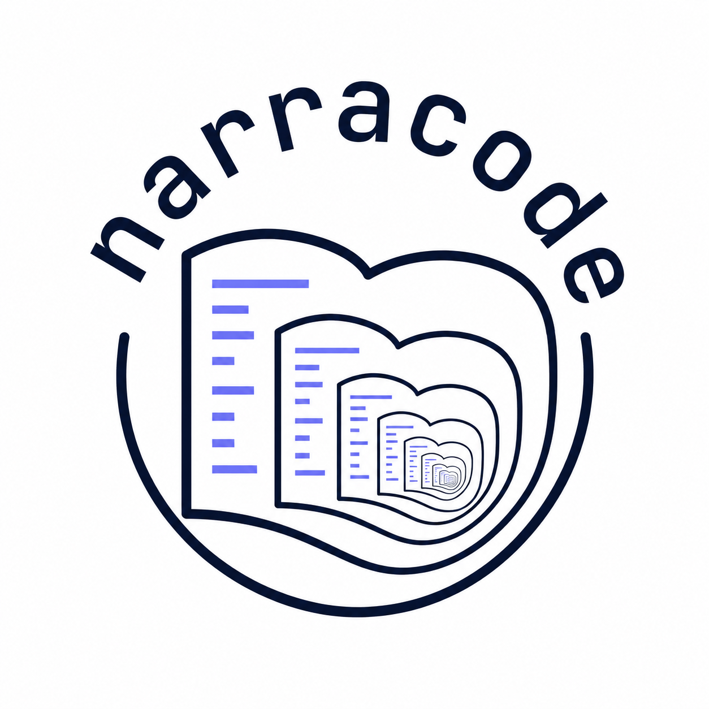
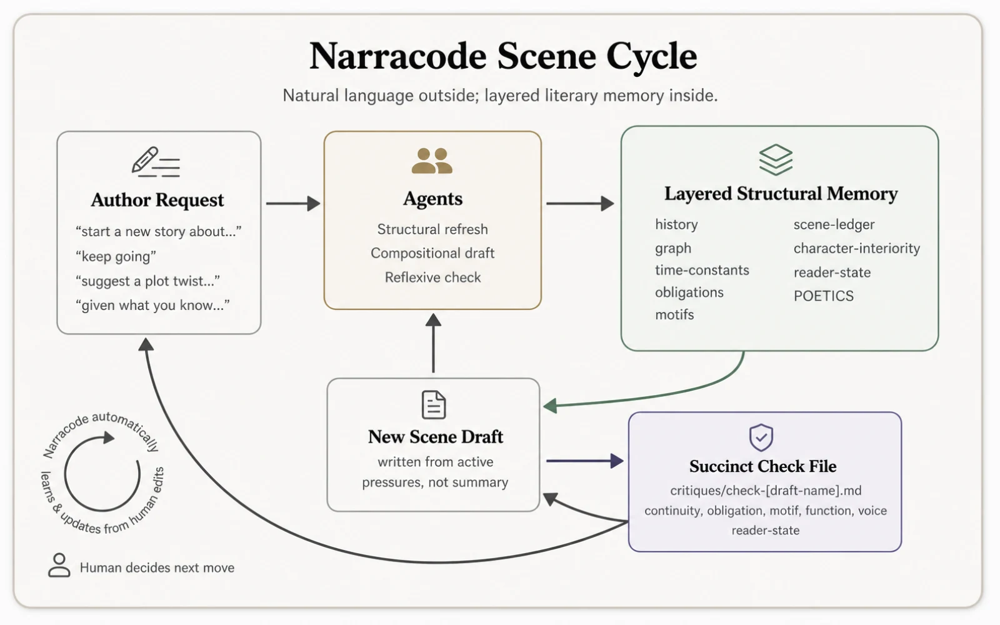

<p align="center">
  
</p>

# Narracode: a *Claude Code* for literature.

Computer code is a solved problem for AI. Why not literature? 

Narracode is a storytelling harness for agentic AI. Inspired by Claude Code, it is a neurosymbolic approach to narrative generation.

🌐 **Live site:** [jhave.github.io/narracode](https://jhave.github.io/narracode/)

- **LLM** = Neuro layer
- **Harness** = Symbolic layer

🌐 **Download the harness:** [narracode.md](./narracode.md) [It's one file that unfolds into the system. Just ask your agent to read it and initiate a new project.]

Narracode is not just a tool; it is a philosophical statement. It is an argument that narrative, too, can be treated as a form of code—structured, intentional, and amenable to the kind of architectural reasoning that has made AI so powerful for programming.

It emerged from the realization that the intrinsic embodied complexity of nuanced narrative might become computationally tractable by recursively entwining a LLM with a symbolic harness that is somehow equivalent to Claude Code, specifically re-purposed for narrative literature.  

## Publishing workflow & branch hygiene

Stories are developed on short-lived branches and published to `main`, which deploys to the [live site](https://jhave.github.io/narracode/) via GitHub Pages.

1. **One branch per story** — `git switch -c story/<name>` off `main`.
2. **Draft on the branch** — story folder under `Stories written with Narracode/<DD-MM-YYYY_Title>/` (POETICS, ATTRIBUTION, drafts, structural, versions, img).
3. **Publish via PR** — in the same PR, add the story folder, its homepage card in `index.html`, and its `metadata.md` entry. (The homepage listing is hand-maintained; don't blindly regenerate it with `build_main_index.py`.) Then `gh pr create --base main --fill` and `gh pr merge --squash --delete-branch`.
4. **Auto-cleanup** — "Automatically delete head branches" is enabled, so merged branches are removed on merge. For work you won't merge, archive it (`git tag archive/<name> <branch>`) before deleting.

> **On "duplicates in every branch":** git doesn't copy stories into branches. Content is stored once by hash in `.git` (all branches share unchanged objects); a branch is just a pointer. The real disk cost is extra **worktrees** — each is a full checkout (~120 MB here). Keep few; prune stale ones with `git worktree remove`.

## Full Installation (with examples)

1. Clone this repository to your local machine.
2. Open the repository in your IDE alongside an agentic AI assistant (like Claude Code, Cursor, or Gemini).
3. Invoke the harness by typing: `Consult narracode.md and initiate a new project about [your premise].`

## Quickstart & Natural Language Commands

Narracode operates via an intuitive, natural language interface. You do not need to memorize rigid CLI-like commands. The AI interprets your conversational requests and maps them to the correct underlying agent:

- **"Keep going" or "Write the next scene"** → *Compositional Agent* (Drafts the next sequence).
- **"How does this sound?" or "Are we losing the style?"** → *Reflexive Agent* (Critiques the text against the POETICS.md rules).
- **Autonomous Versioning & Learning** → The agent autonomously evaluates when major changes occur (such as advancing the plot or receiving your human edits). It will auto-save version snapshots non-destructively to the `versions/` folder.
- **"Save this" or "Looks good, let's lock it in"** → *Structural Agent* (Optionally explicitly request a manual snapshot).

> [!IMPORTANT]
> **The Seamless Edit Method**: You are free (and encouraged) to edit the AI's drafts directly in your IDE. This is a crucial feature of Narracode. Whenever the AI autonomously saves a version (or when you prompt it to continue), it automatically compares your manual edits against its original draft. It attempts to learn first principles from your edits—identifying shifts in register, pacing, or syntax—and implements these stylistic learnings in future iterations. (It does this by saving a granular `edit-observations.md` log for each version, and continually pushing recurring, high-level stylistic rules into the project's central `POETICS.md`.)

## Project Overview

Narracode arises from an inquiry: can we build a literature AI-augmentation system on the same model as Claude Code? One that is structured, algorithmic, agentic — but for literary purposes? 

### Neurosymbolic Narrative Architecture

Historically, AI falls into 2 camps: symbolic AI (plans, templates, expert systems) and connectionist AI (neural networks, large language models).  

Symbolic AI has failed at narrative because it treats it as a planning problem. Connectionist AI has succeeded at generating text, but has failed to capture the deeper structures of narrative, the way that stories are not just strings of words, but systems of relations, temporalities, characters and atmospheres. 

Narracode is an attempt to bridge this gap. It is a neurosymbolic approach to narrative generation. It is a tool for orchestrating agents specifically for literary purposes. 

- *Neuro*: the LLM
- *Symbolic*: the harness

The core premise is that the architecture of a narrative generator is not neutral; rather, it is a "narrative philosophy" written in code. The structural logic of a program—its "Narracode"—acts as a set of cognitive and social presuppositions that fundamentally shape the generated story-world.

## Narrative Architecture (Symbolic Harness provided by Narracode)

Narracode's narrative philosophy is encoded in:

- **the main harness** (`narracode.md` itself, establishing the rules and boundaries)
- **the agent roles**: Narracode forces the LLM to operate in strictly separated passes to avoid the "average" output of a single-shot prompt. The roles are:
  - **Initiator**: Drafts the initial constraints and poetics document (`POETICS.md`).
  - **Reading Agent**: Analyzes provided uploads across multiple dimensions (temporal posture, focal scale, syntactic strain, etc.).
  - **Structural Agent**: Maintains the layered working memory by updating relations, time, established history, unresolved obligations, motifs, scene function, character interiority, and reader-state.
  - **Compositional Agent**: Drafts prose from the active pressures in the structural state, not from a flat summary of the plot.
  - **Reflexive Agent**: Runs in *Critique* mode (analyzing a draft against commitments), *Check* mode (a succinct post-draft protocol), or *Drift* mode (checking if the cumulative piece is finding fertile new ground or regressing to genre tropes).
  - **Expansion Agent**: Generates alternative continuations that intentionally push beyond the boundaries of the uploads.
- **the symbolic harness** (the directory structure that externalizes state into separate files)
- **the evaluation harness** (the critique and drift check protocols, and pre-edit comparisons)
- **the memory system** (the structural files, annotations, uploads, and version snapshots)

### Structural Harness

The `structural/` folder is the system's layered working memory, separating generative flow from narrative continuity. Earlier versions tracked mostly factual continuity. The current harness expands this into a literary memory that preserves accumulated pressure across scenes.



- **`graph.md`**: Maps entities, characters, institutions, places, and their shifting relationships.
- **`time-constants.md`**: Tracks chronology, durations, simultaneities, deadlines, and physical constraints.
- **`history.md`**: Records what has definitively happened, been said, refused, or established.
- **`obligations.md`**: Tracks planted objects, unanswered questions, withheld information, unresolved events, emotional debts, and promises the story has made the reader wait for.
- **`motifs.md`**: Tracks recurring images, gestures, objects, phrases, textures, atmospheres, and symbolic pressures.
- **`scene-ledger.md`**: Treats each scene as a functional unit: what happened, what changed, what remained unresolved, and what the scene makes possible next.
- **`character-interiority.md`**: Tracks private states, contradictions, hidden knowledge, possible character-arcs, and possible cathartic inflection points.
- **`reader-state.md`**: Tracks what a first-time reader likely understands, expects, remembers, or wonders, including plausible paths where the plot might answer or defy expectations while remaining credible inside the story-world.

After a new draft, the Reflexive Agent can write one succinct check file:

```text
critiques/check-[draft-name].md
```

The check stays brief and covers continuity, obligations, motifs, scene function, voice/default, and reader-state. It identifies risks and possibilities without scoring or rewriting the draft.

### Folder Layout

When initiated, the agent builds a minimalist core structure. Auxiliary folders are generated lazily only when requested.

```text
./
  POETICS.md                (project commitments, refused elements, dialect)
  ATTRIBUTION.md            (authorship attribution: human and AI models)
  drafts/                   (timestamped draft versions)
  structural/               (layered working memory)
    graph.md
    time-constants.md
    history.md
    obligations.md
    motifs.md
    scene-ledger.md
    character-interiority.md
    reader-state.md
```

*(Note: Folders like `versions/`, `uploads/`, `critiques/`, and `annotations/` are generated lazily only when requested or needed.)*


## Current state of the project

The current iteration is a working proof of concept. The system is implemented as a single-file markdown script (in this repo) that implements this architecture. Built with Claude CoWork on May 8-9, 2026. Amended by Gemini 3.1 Pro High on May 10, 2026. It includes test stories written with the system.

Future iterations will implement a real Claude Code harness (i.e. a CLI tool that implements this architecture).


## Background Information on Claude Code (*how it became public*)

Claude Code is a CLI tool developed by Anthropic for AI-assisted software development. It has been extremely popular and is extremely powerful. 

On March 31, 2026, Anthropic accidentally leaked the full source code of Claude Code (the CLI coding agent) via a 59.8 MB source map file bundled in NPM package version 2.1.88. The leak revealed 500,000+ lines of TypeScript, including its system prompt, tool logic (bash, edit), and agentic loop, sparking widespread analysis. 

So now the architecture of the system is public. And it has been [re-written and is fully functional online](https://github.com/weikma/claude-code-rebuilt).

## Historical Computational Narrative Systems

*(This section synthesizes an analysis from a [Claude conversation on narrative architecture](https://claude.ai/share/c262de57-1678-4bf5-a437-260aac71b497))*

### [CascadeMind (Kawada & Holyoak, 2026)](https://scholar.google.com/scholar?q=CascadeMind+Kawada+Holyoak+2026)
- **Type**: Neurosymbolic judge
- **Model**: Narrative similarity classification using a cascade architecture. Employs LLM neural voting with supermajority thresholds, falling back to symbolic ensembles for uncertain scenarios.
- **Bias**: Evaluates narratives for measurable "similarity", rather than generating them.
- **Presupposition**: Ambiguity and uncertainty are obstacles to be managed by prioritizing connectionist models, utilizing symbolic structures merely as tie-breakers.

### [METATRON (Concepción et al., 2025)](https://www.scilit.com/publications/91502a971246441f8c8535bac542912a)
- **Type**: Neurosymbolic
- **Model**: Narrative as the instantiation of classical European dramaturgy. Uses Georges Polti’s 36 dramatic situations as a symbolic planning substrate, with an LLM rendering the text and a coherence filter checking fidelity.
- **Bias**: A triple-layered bias combining 19th-century European theatrical canons, the LLM’s genre-heavy pretraining, and the coherence filter's aversion to deviation.
- **Presupposition**: Dramatic situations are a finite, enumerable set that precedes character interiority. It assumes stories have clear recognizable arcs (complication, catastrophe) and penalizes the emergence of new, unnamed narrative shapes.

### [Affective Reasoner + ChatGPT (Clark Elliott, 2023)](https://link.springer.com/chapter/10.1007/978-3-031-47715-7_50)
- **Type**: Neurosymbolic
- **Model**: Narrative as emotionally-driven scenario generation. Uses the classic Affective Reasoner (based on the OCC cognitive model of emotion) as an underlying symbolic state engine to prompt an LLM to render the textual surface.
- **Bias**: Inherits the OCC model's highly structured, appraisal-based view of emotion (e.g., joy, distress, hope, fear as mathematical functions of goal-congruence and blameworthiness).
- **Presupposition**: Emotion can be formally categorized and mathematically appraised before language is applied. The symbolic engine calculates *how* a character feels, while the LLM merely translates that calculus into prose.

### [CoRRPUS (Martin et al., 2022)](https://arxiv.org/abs/2212.10754)
- **Type**: Neurosymbolic story understanding
- **Model**: Narrative understanding via Code-based Structured Prompting. Prompts LLMs to extract a structured, code-like "world model" from a story to track character locations, relationships, and logical states.
- **Bias**: Biased towards literal, physical, and state-machine-like interpretations of stories, where a character's state can be cleanly serialized as code.
- **Presupposition**: Linguistic neural networks are too flexible to maintain long-range coherence natively, requiring a symbolic code representation of the story state to prevent hallucination. 

### [Commonsense-inference Augmented neural StoryTelling (CAST) (Peng, Li, Wiegreffe, Riedl, 2022)](https://arxiv.org/abs/2105.01311)
- **Type**: Neurosymbolic
- **Model**: Narrative as goal-coherence over learned commonsense distributions. Uses an LLM to generate continuations, and the COMET commonsense inference graph to filter them for consistency with character intent.
- **Bias**: Relies on crowdworkers' annotations of human psychology, steering narratives toward legible, predictable, transactionally social behavior while filtering out complex, contemplative, or unpredictable literary moves.
- **Presupposition**: Coherence is the highest narrative virtue. It models the reader as constantly updating a mental model of what characters "would do next," making character action (rather than setting or silence) the unit of narrative interest.

### [Curveship (Nick Montfort, 2009)](https://nickm.com/curveship/)
- **Type**: Symbolic interactive fiction generator
- **Model**: Separates the underlying simulated world (the *histoire*) from the narrative discourse (the *récit*), allowing the same sequence of events to be told from different perspectives, focalizations, or temporal orders (e.g., flashback).
- **Bias**: Formalist and narratological. It treats the telling of a story as a highly structured set of parameters that can be toggled mathematically.
- **Presupposition**: Narrative is fundamentally divided into content and discourse. By controlling the discourse parameters, a single objective world-state can yield infinite subjective tellings.

### [Façade (Michael Mateas & Andrew Stern, 2005)](https://en.wikipedia.org/wiki/Fa%C3%A7ade_(video_game))
- **Type**: Symbolic planning / Interactive Drama
- **Model**: Narrative as a tension-managed interactive social performance. Uses "beat" managers and behavioral engines to parse user input and orchestrate character responses in real-time.
- **Bias**: Focuses on the intense, upper-middle-class domestic breakdown of a married couple. Limits interaction to a bounded, pressure-cooker social etiquette.
- **Presupposition**: Narrative is a collection of dramatic beats structured by ascending tension. Characters are highly reactive agents managing their own social boundaries and psychological states in response to an unpredictable interactor.

### [MEXICA (Rafael Pérez y Pérez, 1999)](https://en.wikipedia.org/wiki/MEXICA)
- **Type**: Symbolic planning / Cognitive model
- **Model**: Generates plots about the ancient inhabitants of Mexico using the E-R (Engagement-Reflection) model of creativity, cycling between generating new material and evaluating it for coherence and novelty.
- **Bias**: Focuses heavily on the logical progression of emotional links and tension between characters, prioritizing structural completeness over textual nuance.
- **Presupposition**: Creative writing is an iterative cognitive cycle. A story is valid if the emotional and physical states of the characters transition logically according to predefined tension parameters.

### [DayDreamer (Erik Mueller, 1989)](https://en.wikipedia.org/wiki/DayDreamer_(program))
- **Type**: Symbolic planning
- **Model**: Narrative as interior monologue and recursive emotional simulation. Extends case-based reasoning with "daydreaming goals" (rationalization, revenge, recovery) that operate on emotional states.
- **Bias**: Reflects a 1980s Western, autonomous subjectivity. Fixates on instrumental interiority where daydreaming is a functional meta-planning process to resolve wounds, avoiding aimless wandering or unresolvable mourning.
- **Presupposition**: Mental life is goal-structured all the way down, even during rumination. Emotions are signals that mark episodes for re-processing toward closure, and the self is unified across counterfactuals.

### [Racter (William Chamberlain & Thomas Etter, 1983)](https://en.wikipedia.org/wiki/Racter)
- **Type**: Symbolic planning / Procedural generation
- **Model**: Narrative as surface-level lexical juxtaposition and template matching.
- **Bias**: Reflects the "pseudo-intellectual" and surrealist lexicon of its human curators.
- **Presupposition**: Meaning is an emergent property of syntax projected by the reader, rather than a deep simulation of intent. It operates on "timbral/mood-based" logic rather than strict planning.

### [Tailspin (James Meehan, 1976)](https://en.wikipedia.org/wiki/Tale-spin)
- **Type**: Symbolic planning
- **Model**: Narrative as goal-driven problem solving (based on Roger Schank's Conceptual Dependency).
- **Bias**: Individualistic and Western-centric. Success is defined entirely by the achievement of private, material goals.
- **Presupposition**: The mind is a planning engine. The system operates under the assumption that characters lack an unconscious, social context, or collective meaning. It relies heavily on "causal chain" logic.

## Key Concepts

- **Neuro-Symbolic Synergy**: The synthesis of connectionist intuition (LLMs generating dense, localized atmospheric prose) with structural rigor (a symbolic harness maintaining memory, timelines, and causal logic).
- **Plans as Continuity, not Generation**: Unlike historical AI (like *Tailspin*) where rigid planning engines dictated every character action, the symbolic harness in Narracode acts purely as an architectural guardrail. It secures the continuity, freeing the compositional agent to focus entirely on stylistic lucidity, relational density, and deep attention.
- **Code-as-Poetics**: The recognition that algorithms are not neutral vessels. The operational logic of a system—its segregated agent roles, its continuous learning loops, its handling of memory—is a material philosophy of literature encoded as infrastructure.
