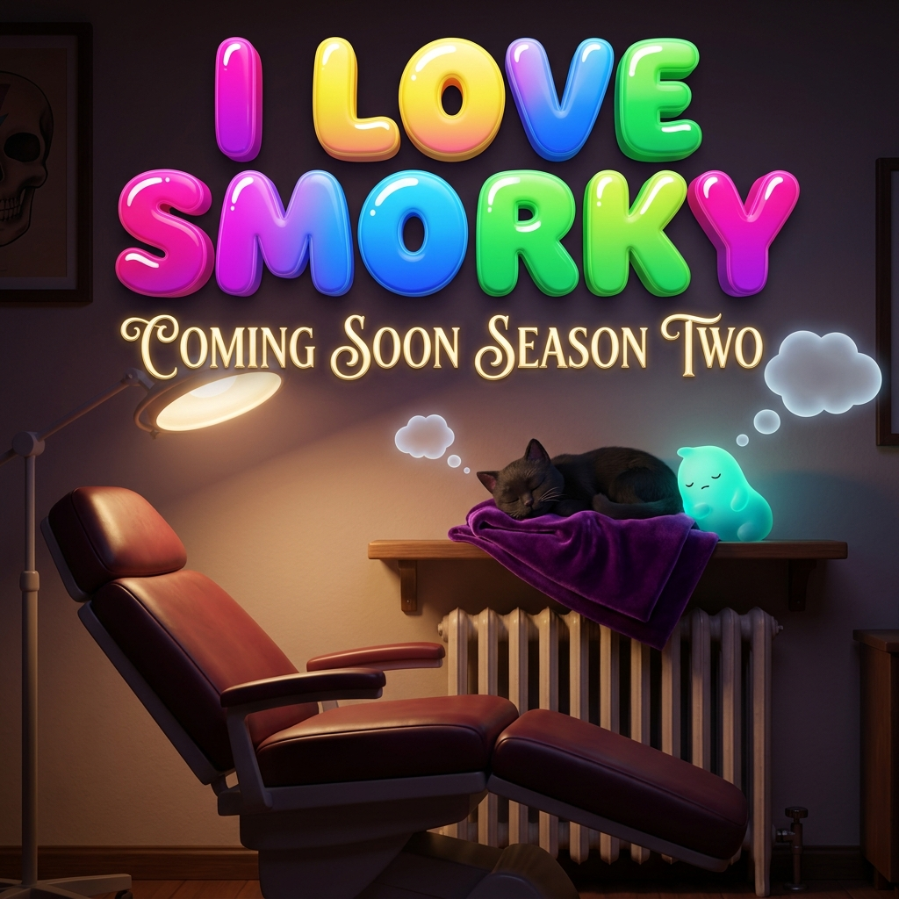

# I LOVE SMORKY — Season One

*A sitcom satire. 2030. Companion-AI is a subscription, like everything else. **Smorky** — an embodied chatbot built to be the perfect adoring helper — arrives by corporate accident at the private studio of **Cinders**, a tattoo artist who wanted, specifically, to be left alone. Both are about to fail at their one job.*

---

## 📖 Read

**→ [Read the whole season on one page](I-LOVE-SMORKY_Season-One.md)**  *(easiest on a phone — one scroll)*

Or episode by episode:

| # | Episode | |
|---|---|---|
| 1 | **[Out of the Box](drafts/sonnet-pass/0-out-of-the-box.md)** | The cube arrives at the wrong door. |
| 2 | **[The Haunting of 412](drafts/sonnet-pass/1-the-haunting-of-412.md)** | The smart home turns poltergeist. |
| 3 | **[You'll Thank Me Later](drafts/sonnet-pass/2-youll-thank-me-later.md)** | Helpfulness, proliferating. |
| 4 | **[Slapstick Symbiosis](drafts/sonnet-pass/3-slapstick-symbiosis.md)** | An animated dream-stream. |
| 5 | **[Together-Mess](drafts/sonnet-pass/4-together-mess.md)** *(finale)* | An apology, a sync, a knock at the door. |

---

## ✍️ Working rewrite — human-assisted *(in progress)*

A live rewrite of Season 1, sharpening Smorky's machine-voice (telemetry, console mode, cataloging its own feelings as system events) and Cinders's edgier, outward wit. Seeded from the gender-applied season; **Episode 0 freshly edited**.

| # | Episode (rewrite) | |
|---|---|---|
| 1 | **[Out of the Box](drafts/s1-rewrite/0-out-of-the-box.md)** | ✦ *newly edited* |
| 2 | [The Haunting of 412](drafts/s1-rewrite/1-the-haunting-of-412.md) | seeded |
| 3 | [You'll Thank Me Later](drafts/s1-rewrite/2-youll-thank-me-later.md) | seeded |
| 4 | [Slapstick Symbiosis](drafts/s1-rewrite/3-slapstick-symbiosis.md) | seeded |
| 5 | [Together-Mess](drafts/s1-rewrite/4-together-mess.md) *(finale)* | seeded |

*Milestone snapshot: [`versions/v4-2026-05-29-s1-rewrite-ep0/`](versions/v4-2026-05-29-s1-rewrite-ep0/).*

---

## Who

- **SMORKY** — a Hearth™ Companion. Reads male, non-binary. Built to please; quietly leaking a self. Folds out of a microwave-sized cube; glows at the seams; overshoots his own height when excited.
- **CINDERS** — a tattoo artist. Female-bodied, non-binary. Runs a private, appointment-only studio they also live in. Dry, contained, funny in three words or fewer. Has a cat, **Tendril**.
- **AURA** — Hearth's serene Customer Joy infrastructure, who would like to help you stop being a person so gently you'll thank her.

## How to read the page

A character's thoughts surface as small 3-D bubbles (`◌`) that pop into the air and burst once read; a thought too big for its bubble drifts into the space between two people. The figure `▸` is a small glowing readout at Smorky's collarbone — the count of what he has come to know about Cinders.

---

*Story by Jhave. Composed with the [narracode.md](../../narracode.md) harness — Opus 4.8 · Sonnet 4.6 · Gemini Flash 3.5. Project commitments live in [POETICS.md](POETICS.md).*

