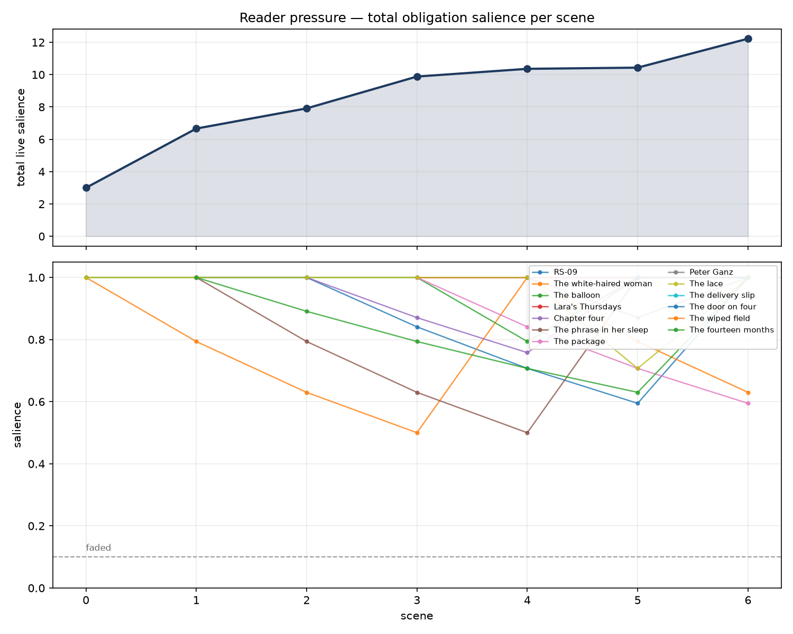

# Experiments 0 and 1 — passes run, and what the ledger found

*2026-08-14. Claude Opus 5. Companion to `plans/2026-08-14_physics-graph-llm-ensemble.md`.*

---

## 1. The passes

Four, in this order. Two touched the harness, two touched one story's structural memory.
No prose was drafted, revised, or read for revision at any point.

**Pass A — snapshot.** `narracode.md` copied to
`narracode_2026-08-14_pre-affect-promotion.md` before any edit. The May-29 testing harness
is left in place unchanged; it is now superseded but remains the record of where the Affect
module was first written.

**Pass B — promotion (Experiment 0).** The Affect module and its dependencies ported *into*
the live `narracode.md` rather than replacing it. This was the reconciliation the May-24
report flagged as required: the testing harness derives from the May-14 file and predates
both AUTO_MODE and `post_draft_tell_scan`, so a straight swap would have silently dropped
two months of work. Ported: the two-loop preamble, `affect.md` as a lazy structural file,
the Affect schema, Discovery mode, the named failure-signature taxonomy, the
`on_affect_discovery` hook, and the affect section in `post_draft_check`. Not ported: the
CRUD/`## Archived` proposal and `refiner-notes.md` from §3.1 and §3.3 of the May report —
separate ideas, deferred so this promotion stays auditable.

**Pass C — the mix.** One section added that was not in the May design, from jhave's note
that affect is like an effect in music and the balance is subtle. See §3.

**Pass D — instrument (Experiment 1).** `## Obligation salience` added to the harness;
`tools/obligation_pressure.py` written; `Interim Edge` snapshotted to
`versions/v5-2026-08-14-pre-salience-annotation/` and its `obligations.md` annotated; the
curve computed and plotted.

---

## 2. Replace this → that

### `narracode.md`

| Was | Now |
|---|---|
| *(no such section)* | **`## The two loops`** — inner loop acts, outer loop edits the scaffolding. Closes with: measurement belongs to the outer loop; a quantity that becomes a goal stops describing the story and starts writing it. |
| *(no such section)* | **`## Obligation salience`** — four fields per obligation, one decay rule, a `## Pressure` line per scene. |
| *(no such section)* | **`## The Affect module`** — the full per-character schema, ported from the May-29 testing harness. |
| *(no such section)* | **`## The Affect module → ### The mix`** — dosage per scene; judge the mix in the mix; effects come off first. New. |
| *(no such section)* | **`## Named failure signatures`** — 6 prose signatures + 6 affect signatures, scanned by name rather than by heading. |
| lazy files: `versions/`, `uploads/`, `critiques/`, `annotations/` | + `structural/affect.md`, created only by `on_affect_discovery` |
| obligations template: `## Active` `## Resolved` `## At Risk Of Neglect` | + `## Faded`, + `## Pressure` |
| Reflexive agent: **four modes** | **five modes** — Critique, Drift, Check, Tell-scan, **Discovery** |
| Check mode covers "continuity, obligations, motifs, scene function, voice/default, and reader-state" | + affect (only when `affect.md` exists **and is confirmed**), and the check reads the scene *with its two neighbours* or omits the affect section entirely |
| Compositional agent reads "current structural state" | reads `affect.md` too when confirmed; sets the scene's mix level before drafting; told explicitly that salience figures are context, never instruction |
| `pre_draft` step 3: infer the next scene's task | step 3 is now salience update; step 4 is the inference, extended with vitality contour, reader-affect target, and mix level |
| `on_init` creates eight structural files | unchanged, plus an explicit *do not create `affect.md`* |
| `post_critique, post_drift, post_structure` | `post_critique, post_drift, post_structure, post_discovery` |
| *(no such hook)* | **`on_affect_discovery`** — Discovery mode proposes entries from the drafts, pauses for confirmation, and the Compositional agent ignores the file until confirmed |
| `on_orient` reads obligations, scene-ledger, interiority, reader-state | + `## Faded`, `## Pressure`, and `affect.md` if present |

### `Stories written with Narracode/30-07-2026_Interim_Edge/structural/obligations.md`

| Was | Now |
|---|---|
| `- **The balloon** — fourth-floor landing. Fuller one week than the last. Who touches it. (Never answer.)` | same line, plus `  planted: s0 \| half-life: 3 \| probes: balloon` |

Thirteen entries, one field line each. **Nothing was deleted or reworded.** The annotation
is additive and reverts by restoring the v5 snapshot.

### New files

- `tools/obligation_pressure.py`
- `plans/figures/interim-edge-pressure.png`
- `narracode_2026-08-14_pre-affect-promotion.md`
- `Stories written with Narracode/30-07-2026_Interim_Edge/versions/v5-2026-08-14-pre-salience-annotation/`

---

## 3. The mix — what jhave's note changed

The May design specified *which* affect primitives exist. It said nothing about *how much*,
and that omission is the module's real failure mode. Entries applied at full wet across
every scene produce uniformly saturated prose, and uniform saturation destroys the dynamic
range that lets any single moment land. An affect module without a level control makes
every scene the loudest scene.

Three rules now govern the module, and they matter more than the schema:

1. **Level is per scene, not per project.** Dry / low / present / wet. Most literary scenes
   are dry or low. More than roughly one in four running wet means the level is wrong, not
   the writing.
2. **Judge the mix in the mix.** The Reflexive agent reads the scene *and its two
   neighbours* before reporting on affect, or does not report on affect. A passage that
   seems underfelt alone is often correct in sequence; a passage that moves in isolation is
   often the one flattening everything after it.
3. **Effects come off first.** When a scene is not working, reduce the affect layer before
   adding to it. The instinct to fix a flat scene with more interiority is precisely the
   instinct that produces the sentimental default the harness exists to interrupt.

Rule 2 is also enforced mechanically in `post_draft_check`: without neighbouring context the
affect section is omitted rather than guessed. And a sixth affect signature was added —
*mix pinned wet*, which reports the **run** of scenes, never the single scene.

---

## 4. Experiment 1 validated on *Interim Edge*

Not the intended test — see §5 — but a real run on a real story, and the instrument
survived it.

Thirteen obligations, seven sections, probes declared in the file so touch-detection is
reproducible rather than recalled.

| scene | live | total salience | mean | touched | faded |
|---|---|---|---|---|---|
| 0 | 3 | 3.00 | 1.00 | 3 | — |
| 1 | 7 | 6.66 | 0.95 | 5 | — |
| 2 | 9 | 7.91 | 0.88 | 4 | — |
| 3 | 12 | 9.88 | 0.82 | 4 | — |
| 4 | 13 | 10.36 | 0.80 | 4 | — |
| 5 | 13 | 10.43 | 0.80 | 5 | — |
| 6 | 13 | **12.22** | 0.94 | **11** | — |

**Finding 1 — the curve is monotone and nothing ever fades.** Total live salience rises
3.00 → 12.22 across seven sections and never falls once. Not a single obligation crosses
the 0.1 floor. Interim Edge's `obligations.md` says *"Resolved: (none — resolution refused
as formal principle)"*, and nine of the thirteen entries are annotated *(Never answer.)*
The ledger reproduces that declared poetics from the field arithmetic alone, without being
told it.

That is the correct first result: the instrument recovers a known intent it was not given.
It also gives the shape a name. **The signature of refused resolution is a monotone-rising
pressure curve with no fade events** — and it predicts what a conventionally resolving story
should look like instead: sawtooth, discharge, recovery. That contrast is testable the
moment there is a second story to run.

**Finding 2 — §6 is a re-arming sweep, and the numbers say so plainly.** The final section
touches eleven of thirteen obligations. The scene ledger describes §6 as *"Everything open.
Nobody running. Makes possible: Nothing. Deliberately."* What the pressure line shows is
that "everything open" is not passive: the section actively resets nearly every thread to
full salience on the way out. The piece does not end holding what accumulated — it ends
having just re-touched all of it. Whether that is the intended effect or one re-arming too
many is a question for jhave, and it is exactly the kind of question the ledger exists to
raise rather than answer.

**Finding 3 — three obligations are touched exactly once.** *The package*, *the delivery
slip*, and *the wiped field*. The first two are meant to be paired: the obligations file
says the slip "does not resolve the package — it doubles it." The ledger says the doubling
never re-touched the original. Under the poetics of non-resolution that may be correct and
deliberate. It is still worth seeing, and it was not visible before.

**Caveat, and it is a real one.** The probes were written *after* reading the scene ledger,
by the same pass that ran the analysis. Probe authorship is a researcher degree of freedom
and I had access to the answer. This run demonstrates that the instrument works and produces
legible output; it is not evidence about the metric. **Protocol for the real test: write the
probes from `obligations.md` alone, before opening the draft, and do not revise them after
seeing which sections they fire in.**

---

## 5. Blocked: the two named stories are not here

`Garaiv` and `Spiral Brief` do not exist in this repository. Checked: the working tree, all
branches (`main`, `claude/ai-ensemble-literature-2olipt`), the full commit history across all
refs (`git log --all --name-only`), and all tags. No file, folder, or commit mentions either
name. The 26 story folders present are listed in `Stories written with Narracode/`, and the
only one not linked from `index.html` is `30-07-2026_Interim_Edge`.

They are presumably local-only and unpushed. Once they are pushed, the run is two commands
per story and the blind-probe protocol above applies.

---

## 6. What this does not yet show

`Interim Edge` is n=1, its poetics is unusually explicit about non-resolution, and the probes
were not blind. Nothing here yet bears on the Experiment 1 falsification condition, which
needs curves from several finished pieces and jhave's own ranking of them. The instrument is
built and legible. The experiment has not been run.
